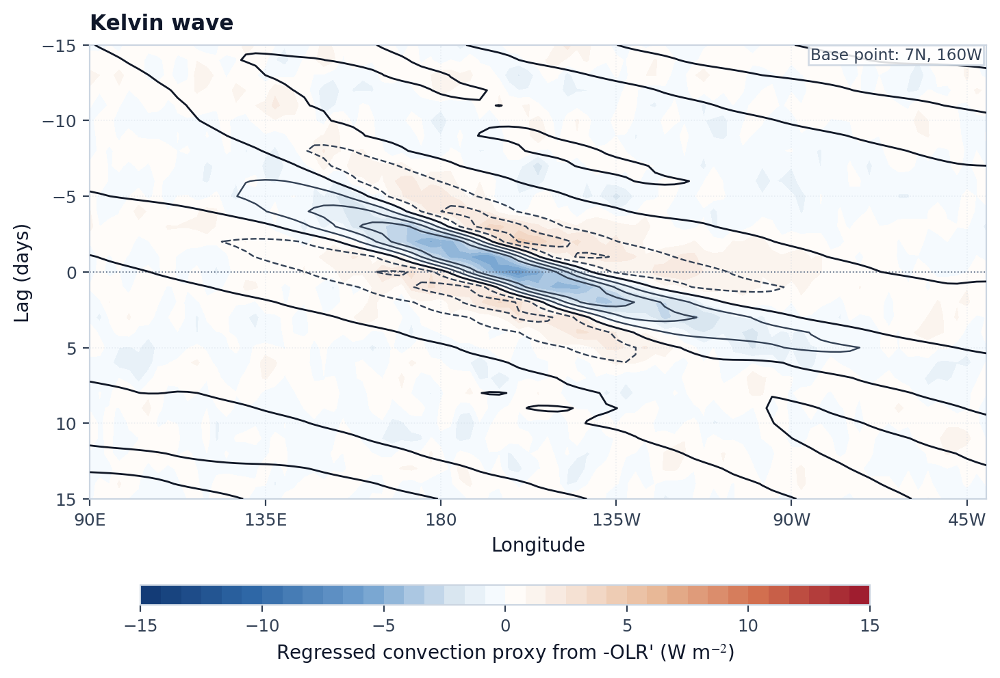

# Gallery

## Featured Cases

<div class="tw-grid tw-grid-2">
  <article class="tw-card tw-gallery-card">
    <p class="tw-card-label">Case 01</p>
    <h3><a href="../gallery/sample-preview/">Sample OLR Preview and Variability</a></h3>
    <p>样例场与异常变率的快速预览。</p>
    
    
    <p><code>open_example_olr</code> · <code>compute_anomaly</code> · <code>standard_deviation</code></p>
    <p><a class="md-button" href="../gallery/sample-preview/">查看实现</a></p>
  </article>

  <article class="tw-card tw-gallery-card">
    <p class="tw-card-label">Case 02</p>
    <h3><a href="../gallery/wk-spectrum-case/">WK Spectrum as the Flagship Diagnostic</a></h3>
    <p>频率-波数谱空间中的核心诊断结果。</p>
    
    <p><code>analyze_wk_spectrum</code> · <code>plot_wk_spectrum</code></p>
    <p><a class="md-button" href="../gallery/wk-spectrum-case/">查看实现</a></p>
  </article>

  <article class="tw-card tw-gallery-card">
    <p class="tw-card-label">Case 03</p>
    <h3><a href="../gallery/kelvin-hovmoller-case/">Wave Signal Extraction in Space and Time</a></h3>
    <p>用原始 OLR 异常、滤波 OLR 和 U850 三联图查看 Kelvin、ER、MJO、MRG 的传播结构。</p>
    
    <p><code>filter_wave_signal</code> · <code>plot_hovmoller_triptych</code></p>
    <p><a class="md-button" href="../gallery/kelvin-hovmoller-case/">查看实现</a></p>
  </article>

  <article class="tw-card tw-gallery-card">
    <p class="tw-card-label">Case 04</p>
    <h3><a href="../gallery/multiwave-spatial-case/">Filtered Spatial Distributions Across Waves</a></h3>
    <p>按大尺度与西传 synoptic 波两类分组展示 filter 后空间分布。</p>
    
    <p><code>filter_wave_signal</code> · <code>plot_wave_spatial_comparison</code></p>
    <p><a class="md-button" href="../gallery/multiwave-spatial-case/">查看实现</a></p>
  </article>

  <article class="tw-card tw-gallery-card">
    <p class="tw-card-label">Case 05</p>
    <h3><a href="../gallery/variance-fraction-case/">Seasonal Variance-Fraction Diagnostics</a></h3>
    <p>参考 Lubis and Jacobi (2015) Fig. 12 与 Fig. 14，展示 Kelvin、ER、MRG 和 TD-type 对 GPCP 日降水方差的季节调制。</p>
    
    <p><code>compute_monthly_variance_fraction_samples</code> · <code>plot_case05_regional_variance_cycles</code></p>
    <p><a class="md-button" href="../gallery/variance-fraction-case/">查看实现</a></p>
  </article>

  <article class="tw-card tw-gallery-card">
    <p class="tw-card-label">Case 06</p>
    <h3><a href="../gallery/wind-diagnostics-case/">Low-level Wind Divergence and Vorticity</a></h3>
    <p>Kelvin、ER、MJO、MRG 与 TD 的低层风场散度、相对涡度与矢量结构诊断。</p>
    
    <p><code>horizontal_divergence</code> · <code>relative_vorticity</code> · <code>plot_wind_diagnostics_panel</code></p>
    <p><a class="md-button" href="../gallery/wind-diagnostics-case/">查看实现</a></p>
  </article>

  <article class="tw-card tw-gallery-card">
    <p class="tw-card-label">Case 08</p>
    <h3><a href="../gallery/lead-lag-case/">Regional Phase Evolution</a></h3>
    <p>参考期刊式相位复合布局，展示 Kelvin、ER、MRG、TD 与 MJO 按各自周期设置的区域聚焦演变与 850 hPa 风场配合。</p>
    
    <p><code>detect_wave_events</code> · <code>lagged_composite</code> · <code>plot_lagged_horizontal_structure</code></p>
    <p><a class="md-button" href="../gallery/lead-lag-case/">查看实现</a></p>
  </article>

  <article class="tw-card tw-gallery-card">
    <p class="tw-card-label">Case 09</p>
    <h3><a href="../gallery/seasonal-trend-case/">Seasonal Cycle, Annual Evolution and Trend</a></h3>
    <p>对比不同波型的季节经向演变，识别活动中心随季节和经度的迁移。</p>
    
    <p><code>compute_monthly_rms</code> · <code>compute_yearly_rms</code> · <code>plot_wave_annual_trend_comparison</code></p>
    <p><a class="md-button" href="../gallery/seasonal-trend-case/">查看实现</a></p>
  </article>

  <article class="tw-card tw-gallery-card">
    <p class="tw-card-label">Case 10</p>
    <h3><a href="../gallery/paper-hovmoller-case/">Paper-style Lagged Regression Hovmoller</a></h3>
    <p>参考 Lubis and Jacobi (2015) 的时经回归图风格，统一比较 Kelvin、ER、MJO、MRG 与 TD 的传播结构。</p>
    
    <p><code>compute_case10_regression_hovmoller</code> · <code>plot_paper_style_hovmoller</code></p>
    <p><a class="md-button" href="../gallery/paper-hovmoller-case/">查看实现</a></p>
  </article>
</div>

EOF / SVD 诊断页面用于查看不同波型的主模态结构，以及这些模态与 `850 hPa` 风场之间的对应关系。

## Minimal Code

```python
from tropical_wave_tools import open_example_olr
from tropical_wave_tools.filters import filter_wave_signal
from tropical_wave_tools.plotting import plot_wave_spatial_comparison

data = open_example_olr()
waves = ["mrg", "td"]
fields = [filter_wave_signal(data, wave_name=wave, method="cckw", n_workers=1).std("time") for wave in waves]
fig, axes = plot_wave_spatial_comparison(fields, titles=[wave.upper() for wave in waves], ncols=2)
```
