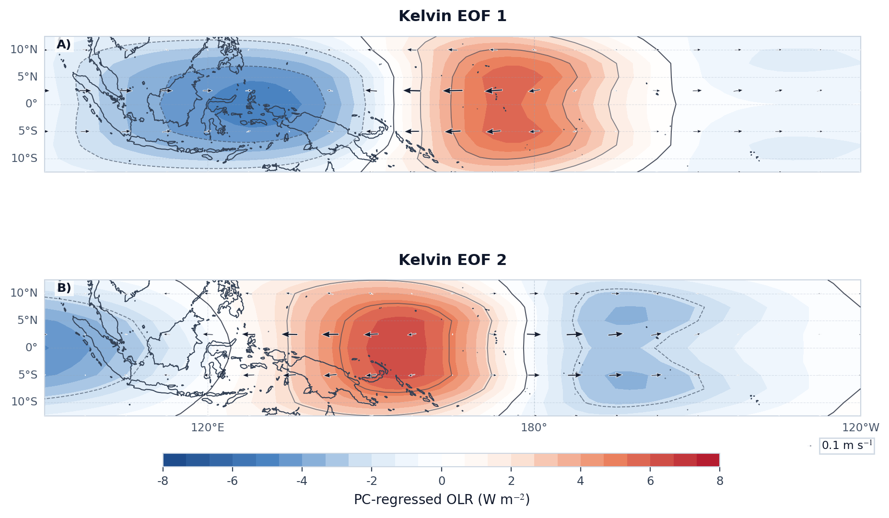
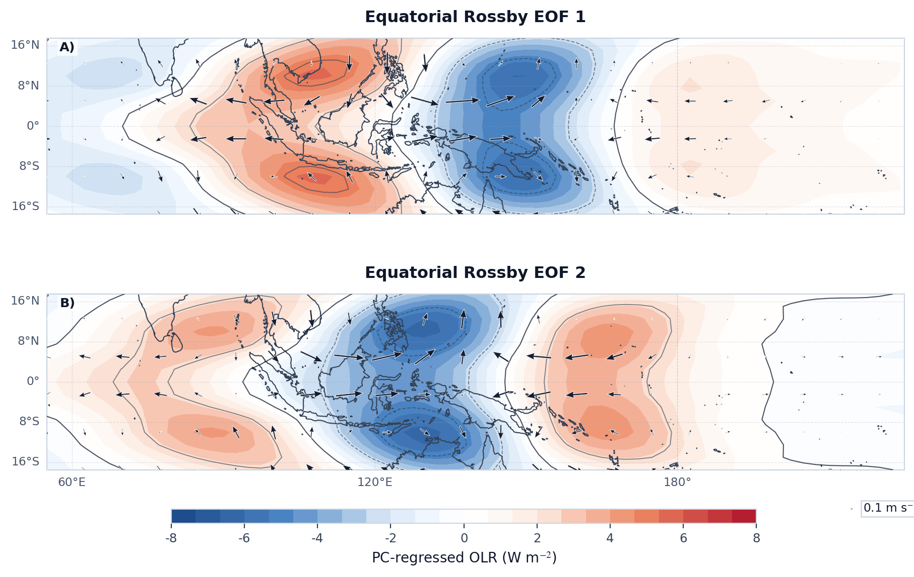
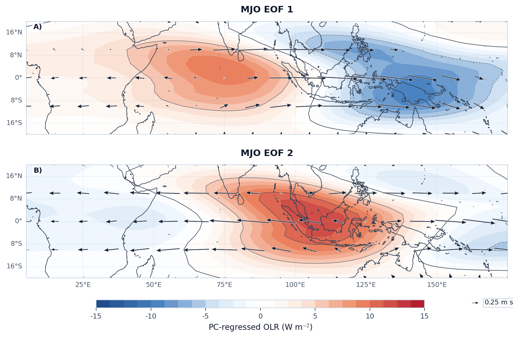
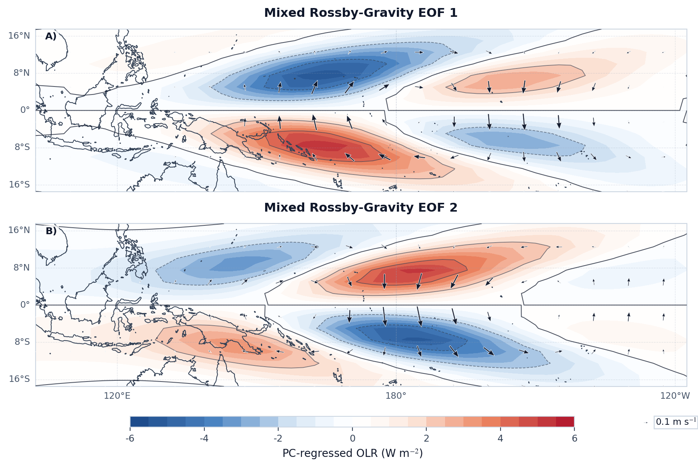
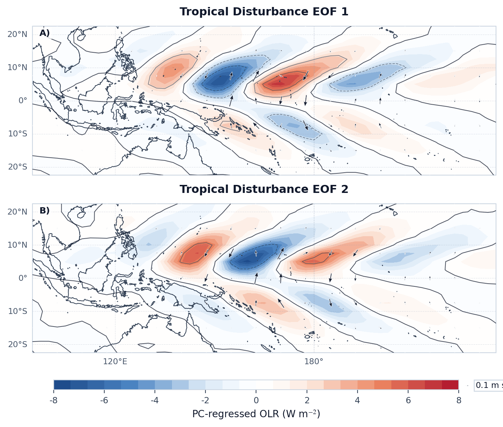

# Case 07: EOF Modes with Low-level Wind Regression







这组图用于识别不同波型的主空间模态，并检查模态结构与 `850 hPa` 风场之间的协同关系。对于传播型信号，`EOF 1` 与 `EOF 2` 常对应一对近似正交的 quadrature pair，因此前两模态解释方差接近通常是可预期的。读图时建议按波型核对以下特征：

- `Kelvin`：主模态应保持明显的赤道对称结构，且低层风异常以纬向分量为主，这与 Kelvin 波的经典浅水结构一致（Matsuno, 1966; Kiladis et al., 2009）。
- `ER`：EOF 模态应体现离赤道双峰和更明显的旋转性低层风场，对应 `n = 1` ER 波的 Rossby 型经向结构（Matsuno, 1966; Kiladis et al., 2009）。
- `MJO`：主模态应表现为宽尺度 Indo-Pacific 对流包络及其伴随的低层环流异常，更适合从大尺度组织结构而非局地波列去理解（Wheeler and Hendon, 2004）。
- `MRG`：模态应保持南北反对称结构，并伴随明显的反对称低层风响应，这是 MRG 波的重要判据之一（Yang et al., 2007; Kiladis et al., 2009）。
- `TD`：模态更适合作为西北太平洋扰动带和 vortex-train 结构的补充诊断，通常不如 Kelvin、ER 或 MJO 那样具有全球尺度代表性（Lubis and Jacobi, 2015）。

## Minimal Code

```python
from tropical_wave_tools.atlas import compute_wave_eof, regress_field_onto_pcs
from tropical_wave_tools.plotting import plot_eof_modes_with_wind

waves = ["kelvin", "er", "mjo", "mrg", "td"]
for wave in waves:
    eof_modes, pc_scores, variance, eof_input = compute_wave_eof(
        filtered_olr[wave],
        wave_name=wave,
        n_modes=2,
    )
    olr_modes = regress_field_onto_pcs(eof_input, pc_scores, standardize_pc=True)
    u_modes = regress_field_onto_pcs(
        filtered_u850[wave].sel(lat=eof_input["lat"]),
        pc_scores,
        standardize_pc=True,
    )
    v_modes = regress_field_onto_pcs(
        filtered_v850[wave].sel(lat=eof_input["lat"]),
        pc_scores,
        standardize_pc=True,
    )

    fig, axes = plot_eof_modes_with_wind(
        olr_modes,
        u_modes,
        v_modes,
        variance,
        modes=(1, 2),
        wave_name=wave,
        quiver_stride=3,
        integer_colorbar=True,
        field_label="PC-regressed OLR (W m$^{-2}$)",
    )
```

## Core Functions

- `EOFAnalyzer`
- `compute_wave_eof`
- `regress_field_onto_pcs`
- `plot_eof_modes_with_wind`

## References

- Matsuno, T., 1966: Quasi-geostrophic motions in the equatorial area. *Journal of the Meteorological Society of Japan*, 44, 25-43. https://doi.org/10.2151/jmsj1965.44.1_25
- Wheeler, M. C., and H. H. Hendon, 2004: An all-season real-time multivariate MJO index. *Monthly Weather Review*, 132, 1917-1932. https://doi.org/10.1175/1520-0493(2004)132<1917:AARMMI>2.0.CO;2
- Yang, G.-Y., B. J. Hoskins, and J. M. Slingo, 2007: Convectively coupled equatorial waves. Part II: Numerical simulations. *Journal of the Atmospheric Sciences*, 64, 3426-3443. https://doi.org/10.1175/JAS4018.1
- Kiladis, G. N., M. C. Wheeler, P. T. Haertel, K. H. Straub, and P. E. Roundy, 2009: Convectively coupled equatorial waves. *Reviews of Geophysics*, 47, RG2003. https://doi.org/10.1029/2008RG000266
- Lubis, S. W., and C. Jacobi, 2015: The modulating influence of convectively coupled equatorial waves on the variability of tropical precipitation. *International Journal of Climatology*, 35, 1465-1483. https://doi.org/10.1002/joc.4069

## Source Files

- [`src/tropical_wave_tools/eof.py`](https://github.com/Blissful-Jasper/tropical-wave-tools/blob/main/src/tropical_wave_tools/eof.py)
- [`src/tropical_wave_tools/plotting.py`](https://github.com/Blissful-Jasper/tropical-wave-tools/blob/main/src/tropical_wave_tools/plotting.py)
- [`src/tropical_wave_tools/atlas.py`](https://github.com/Blissful-Jasper/tropical-wave-tools/blob/main/src/tropical_wave_tools/atlas.py)
