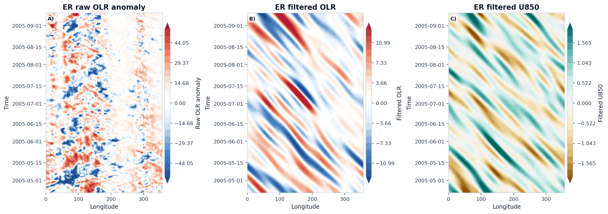
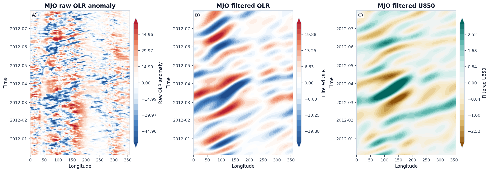
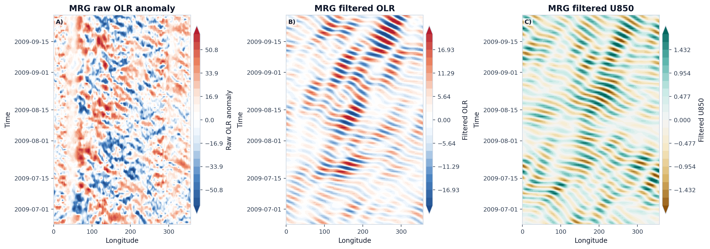

# Case 03: Representative Hovmoller Propagation








这组三联图把 `原始 OLR 异常`、`滤波 OLR` 和 `滤波 U850` 放在一起，用来检查传播方向、尺度选择和低层风场响应是否一致。读图时的关键特征是：`Kelvin` 和 `MJO` 应表现为东传；`ER` 应表现为较慢的西传；`MRG` 更适合从离赤道纬带平均里读其西传相位，而不是只盯最宽的包络。`U850` 面板主要用于检查滤波后的风场位相是否与对流信号保持连贯。

## Minimal Code

```python
from tropical_wave_tools.atlas import WAVE_HOVMOLLER_WINDOWS, select_hovmoller_window, wave_longitude_projection
from tropical_wave_tools.filters import filter_wave_signal
from tropical_wave_tools.preprocess import compute_anomaly
from tropical_wave_tools.plotting import plot_hovmoller_triptych

raw_olr_anomaly = compute_anomaly(olr, group="month")

for wave_name in ["kelvin", "er", "mjo", "mrg"]:
    filtered_olr = filter_wave_signal(olr, wave_name=wave_name, method="cckw", n_workers=1)
    filtered_u850 = filter_wave_signal(u850, wave_name=wave_name, method="cckw", n_workers=1)
    window = select_hovmoller_window(
        filtered_olr,
        wave_name=wave_name,
        lat_band=(-5, 5),
        lon_ref=180.0,
        window_days=WAVE_HOVMOLLER_WINDOWS.get(wave_name, 240),
    )
    fig, axes = plot_hovmoller_triptych(
        [
            wave_longitude_projection(raw_olr_anomaly, wave_name=wave_name, lat_band=(-5, 5)).sel(time=window),
            wave_longitude_projection(filtered_olr, wave_name=wave_name, lat_band=(-5, 5)).sel(time=window),
            wave_longitude_projection(filtered_u850, wave_name=wave_name, lat_band=(-5, 5)).sel(time=window),
        ],
        titles=(
            f"{wave_name.upper()} raw OLR anomaly",
            f"{wave_name.upper()} filtered OLR",
            f"{wave_name.upper()} filtered U850",
        ),
    )
```

## Core Functions

- `filter_wave_signal`
- `plot_hovmoller_triptych`
- `wave_longitude_projection`
- `select_hovmoller_window`

## References

- Wheeler, M., and G. N. Kiladis, 1999: Convectively coupled equatorial waves: analysis of clouds and temperature in the wavenumber-frequency domain. *Journal of the Atmospheric Sciences*, 56, 374-399. https://doi.org/10.1175/1520-0469(1999)056<0374:CCEWAO>2.0.CO;2
- Kiladis, G. N., M. C. Wheeler, P. T. Haertel, K. H. Straub, and P. E. Roundy, 2009: Convectively coupled equatorial waves. *Reviews of Geophysics*, 47, RG2003. https://doi.org/10.1029/2008RG000266
- Lubis, S. W., and C. Jacobi, 2015: The modulating influence of convectively coupled equatorial waves on the variability of tropical precipitation. *International Journal of Climatology*, 35, 1465-1483. https://doi.org/10.1002/joc.4069

## Source Files

- [`src/tropical_wave_tools/filters.py`](https://github.com/Blissful-Jasper/tropical-wave-tools/blob/main/src/tropical_wave_tools/filters.py)
- [`src/tropical_wave_tools/plotting.py`](https://github.com/Blissful-Jasper/tropical-wave-tools/blob/main/src/tropical_wave_tools/plotting.py)
- [`src/tropical_wave_tools/atlas.py`](https://github.com/Blissful-Jasper/tropical-wave-tools/blob/main/src/tropical_wave_tools/atlas.py)
- [`scripts/generate_gallery.py`](https://github.com/Blissful-Jasper/tropical-wave-tools/blob/main/scripts/generate_gallery.py)
