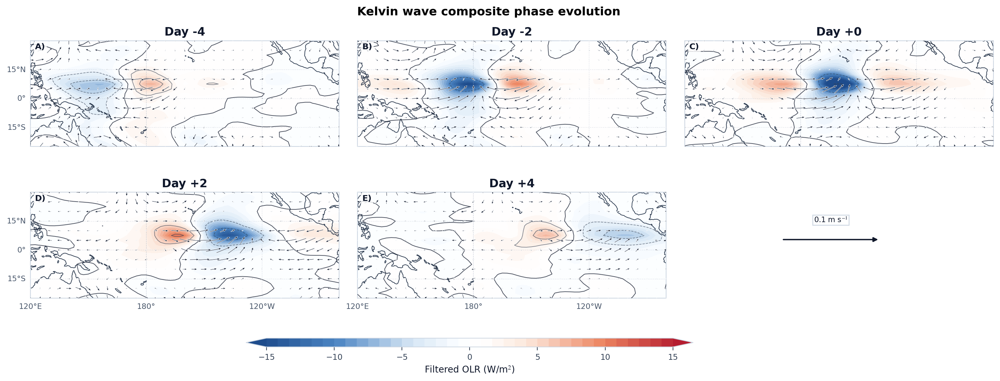
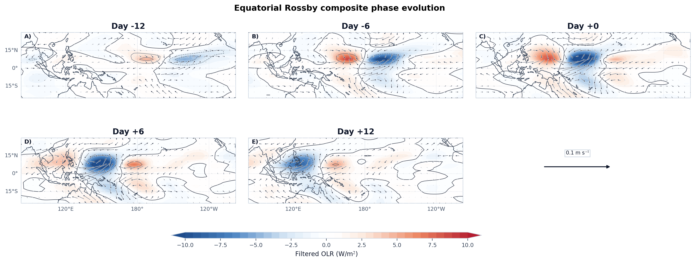
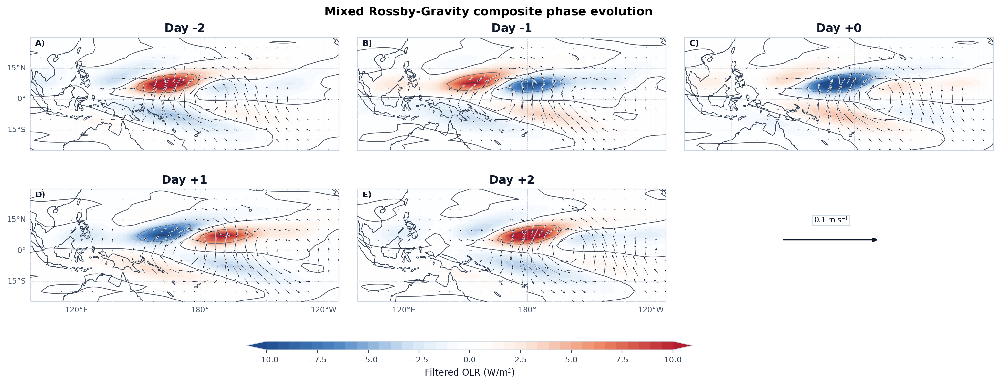
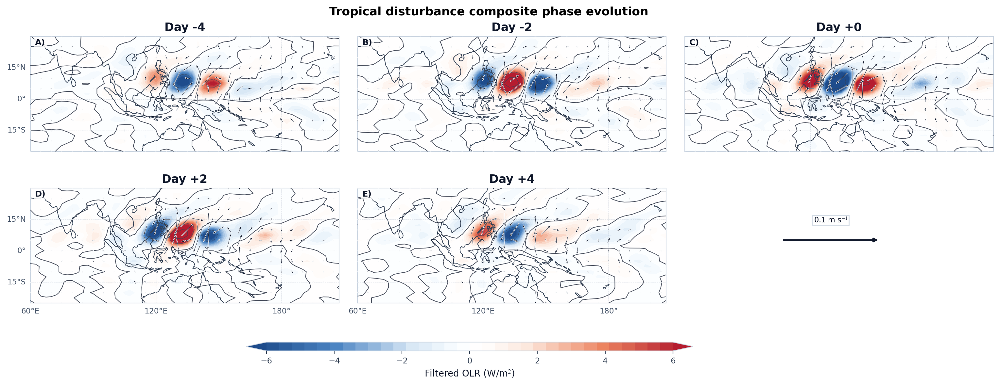
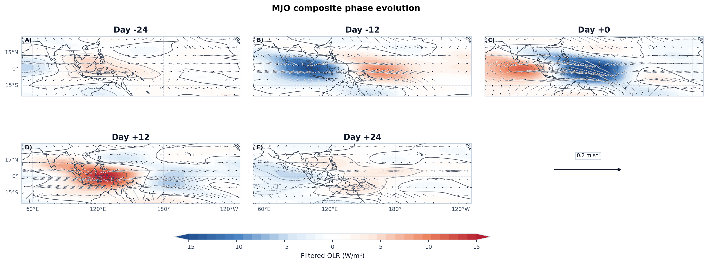

# Case 08: Regional Phase Evolution







## Physical Meaning

- `Kelvin`: 重点核对赤道附近负 `OLR` 对流中心的东传，以及与其同步移动的低层纬向风异常。Kelvin 波的典型特征是赤道对称、经向尺度较窄，并以纬向风响应为主（Matsuno, 1966; Kiladis et al., 2009）。
- `ER`: 重点核对离赤道对流中心和低层 Rossby gyres 的西传。`ER` 的相位演变通常表现为赤道两侧更清楚的旋转型环流，并伴随较宽的西传位相窗口（Matsuno, 1966; Kiladis et al., 2009）。
- `MRG`: 重点核对偏离赤道的反对称对流和低层风旋结构，以及 `4–6 day` 尺度上的快速西传相位。若主要负 `OLR` 中心和对应风场核心向西移动，则与文献中的 `westward phase propagation` 一致（Yang et al., 2007; Lubis and Jacobi, 2015）。
- `TD`: 重点核对西北太平洋和季风槽附近的西传扰动带，以及活跃中心随时间向西并偏向西北侧延伸的演变。`TD-type` 扰动更适合放在区域尺度背景下理解，而非严格赤道束缚模态（Lubis and Jacobi, 2015; Kiladis et al., 2009）。
- `MJO`: 重点核对从印度洋向海陆大陆和西太平洋延伸的缓慢东传大尺度包络，以及伴随对流中心演变的低层西风异常与辐合带。MJO 的诊断重点是包络传播和大尺度组织，而不是单一高频位相线（Wheeler and Hendon, 2004; Kiladis et al., 2009）。

## Minimal Code

```python
from tropical_wave_tools.atlas import detect_wave_events, lagged_composite
from tropical_wave_tools.plotting import plot_lagged_horizontal_structure

case08_lags = {
    "kelvin": (-4, -2, 0, 2, 4),
    "er": (-12, -6, 0, 6, 12),
    "mrg": (-2, -1, 0, 1, 2),
    "td": (-4, -2, 0, 2, 4),
    "mjo": (-24, -12, 0, 12, 24),
}

for wave_name, lags in case08_lags.items():
    if wave_name in {"kelvin", "er", "mrg", "td"}:
        event_indices, reference = detect_point_events(
            filtered_olr[wave_name],
            base_lat={"kelvin": 7.0, "er": 7.5, "mrg": 7.5, "td": 7.5}[wave_name],
            base_lon={"kelvin": 200.0, "er": 172.5, "mrg": 172.5, "td": 133.0}[wave_name],
        )
    else:
        event_indices, reference = detect_wave_events(filtered_olr[wave_name], wave_name=wave_name, lon_ref=150.0)
    lagged_olr = lagged_composite(filtered_olr[wave_name], event_indices, lags=lags)
    lagged_u = lagged_composite(filtered_u850[wave_name], event_indices, lags=lags)
    lagged_v = lagged_composite(filtered_v850[wave_name], event_indices, lags=lags)
    fig, axes = plot_lagged_horizontal_structure(
        lagged_olr,
        lagged_u,
        lagged_v,
        lags=lags,
        ncols=3,
        focus_longitude=True,
        colorbar_extend="both",
    )
```

## Core Functions

- `detect_wave_events`
- `lagged_composite`
- `plot_lagged_horizontal_structure`

## References

- Matsuno, T., 1966: Quasi-geostrophic motions in the equatorial area. *Journal of the Meteorological Society of Japan*, 44, 25-43. https://doi.org/10.2151/jmsj1965.44.1_25
- Wheeler, M. C., and H. H. Hendon, 2004: An all-season real-time multivariate MJO index. *Monthly Weather Review*, 132, 1917-1932. https://doi.org/10.1175/1520-0493(2004)132<1917:AARMMI>2.0.CO;2
- Yang, G.-Y., B. J. Hoskins, and J. M. Slingo, 2007: Convectively coupled equatorial waves. Part II: Numerical simulations. *Journal of the Atmospheric Sciences*, 64, 3426-3443. https://doi.org/10.1175/JAS4018.1
- Lubis, S. W., and C. Jacobi, 2015: The modulating influence of convectively coupled equatorial waves on the variability of tropical precipitation. *International Journal of Climatology*, 35, 1465-1483. https://doi.org/10.1002/joc.4069
- Kiladis, G. N., M. C. Wheeler, P. T. Haertel, K. H. Straub, and P. E. Roundy, 2009: Convectively coupled equatorial waves. *Reviews of Geophysics*, 47, RG2003. https://doi.org/10.1029/2008RG000266

## Source Files

- [`src/tropical_wave_tools/atlas.py`](https://github.com/Blissful-Jasper/tropical-wave-tools/blob/main/src/tropical_wave_tools/atlas.py)
- [`src/tropical_wave_tools/plotting.py`](https://github.com/Blissful-Jasper/tropical-wave-tools/blob/main/src/tropical_wave_tools/plotting.py)
