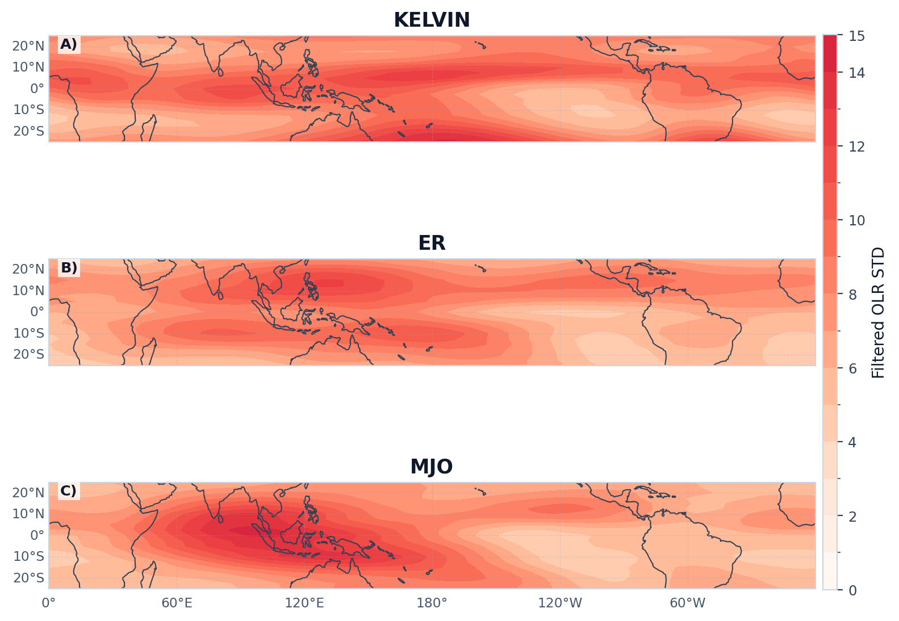

# Case 04: Filtered Spatial Distributions Across Waves




这组图用于比较不同波段过滤后信号振幅的空间分布，并检验其纬向带宽、经向结构与区域活动中心是否符合经典 CCEW 文献。建议按波型分别核对以下特征：

- `Kelvin`：主振幅应集中在赤道附近，呈较强的赤道对称结构，经向宽度相对较窄，代表其典型的 equatorially trapped 特征（Matsuno, 1966; Wheeler and Kiladis, 1999; Kiladis et al., 2009）。
- `ER`：振幅中心通常位于赤道两侧，形成离赤道双峰结构，赤道本身相对较弱，符合 `n = 1` equatorial Rossby 波的典型经向分布（Matsuno, 1966; Kiladis et al., 2009）。
- `MJO`：活动区应表现为更宽的大尺度 Indo-Pacific 包络，空间尺度明显大于高频 CCEW，且常覆盖印度洋至海陆大陆一带（Wheeler and Hendon, 2004; Kiladis et al., 2009）。
- `MRG`：振幅分布应体现偏离赤道的反对称活动特征，常在西太平洋和季风区附近更为清楚，并与其混合 Rossby-gravity 结构一致（Yang et al., 2007; Kiladis et al., 2009; Lubis and Jacobi, 2015）。
- `TD`：主活动中心更适合出现在西北太平洋及季风槽背景下，反映 TD-type 扰动与 off-equatorial vortex trains 的区域偏好（Kiladis et al., 2006; Lubis and Jacobi, 2015）。

将 `large-scale` 与 `westward synoptic` 两组结果并列展示，有助于直接比较不同波型的主活动区域、经向尺度和偏离赤道程度。

## Minimal Code

```python
from tropical_wave_tools.filters import filter_wave_signal
from tropical_wave_tools.plotting import plot_wave_spatial_comparison
from tropical_wave_tools.sample_data import open_example_olr

data = open_example_olr()
wave_groups = {
    "large_scale": ["kelvin", "er", "mjo"],
    "westward": ["mrg", "td"],
}
for group_name, waves in wave_groups.items():
    fields = [filter_wave_signal(data, wave_name=wave, method="cckw", n_workers=1).std("time") for wave in waves]
    fig, axes = plot_wave_spatial_comparison(
        fields,
        titles=[wave.upper() for wave in waves],
        ncols=1,
        cmap="wave_std_red",
        colorbar_orientation="vertical",
        integer_colorbar=True,
        target_steps=16,
    )
```

## Core Functions

- `filter_wave_signal`
- `plot_wave_spatial_comparison`

## References

- Matsuno, T., 1966: Quasi-geostrophic motions in the equatorial area. *Journal of the Meteorological Society of Japan*, 44, 25-43. https://doi.org/10.2151/jmsj1965.44.1_25
- Wheeler, M., and G. N. Kiladis, 1999: Convectively coupled equatorial waves: analysis of clouds and temperature in the wavenumber-frequency domain. *Journal of the Atmospheric Sciences*, 56, 374-399. https://doi.org/10.1175/1520-0469(1999)056<0374:CCEWAO>2.0.CO;2
- Wheeler, M. C., and H. H. Hendon, 2004: An all-season real-time multivariate MJO index. *Monthly Weather Review*, 132, 1917-1932. https://doi.org/10.1175/1520-0493(2004)132<1917:AARMMI>2.0.CO;2
- Yang, G.-Y., B. J. Hoskins, and J. M. Slingo, 2007: Convectively coupled equatorial waves. Part II: Numerical simulations. *Journal of the Atmospheric Sciences*, 64, 3426-3443. https://doi.org/10.1175/JAS4018.1
- Kiladis, G. N., M. C. Wheeler, P. T. Haertel, K. H. Straub, and P. E. Roundy, 2009: Convectively coupled equatorial waves. *Reviews of Geophysics*, 47, RG2003. https://doi.org/10.1029/2008RG000266
- Kiladis, G. N., C. D. Thorncroft, and N. M. J. Hall, 2006: Three-dimensional structure and dynamics of African easterly waves. Part I: Observations. *Journal of the Atmospheric Sciences*, 63, 2212-2230. https://doi.org/10.1175/JAS3741.1
- Lubis, S. W., and C. Jacobi, 2015: The modulating influence of convectively coupled equatorial waves on the variability of tropical precipitation. *International Journal of Climatology*, 35, 1465-1483. https://doi.org/10.1002/joc.4069

## Source Files

- [`src/tropical_wave_tools/filters.py`](https://github.com/Blissful-Jasper/tropical-wave-tools/blob/main/src/tropical_wave_tools/filters.py)
- [`src/tropical_wave_tools/plotting.py`](https://github.com/Blissful-Jasper/tropical-wave-tools/blob/main/src/tropical_wave_tools/plotting.py)
- [`scripts/generate_gallery.py`](https://github.com/Blissful-Jasper/tropical-wave-tools/blob/main/scripts/generate_gallery.py)
