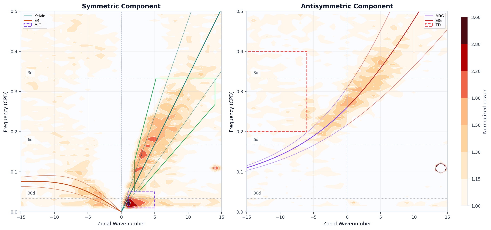

# Built-in OLR Showcase

## Workflow

```text
open_example_olr
  -> anomaly / variability preview
  -> WK spectrum
  -> Kelvin filtering
  -> space-time comparison
  -> multi-wave STD comparison
```

## 1. Preview the Sample and Its Variability

```python
from tropical_wave_tools import open_example_olr
from tropical_wave_tools.preprocess import compute_anomaly
from tropical_wave_tools.stats import standard_deviation
from tropical_wave_tools.plotting import plot_latlon_field

data = open_example_olr()
plot_latlon_field(data.mean("time"), title="Mean OLR over the sample period", cmap="Spectral_r")
plot_latlon_field(
    standard_deviation(compute_anomaly(data, group="month"), dim="time"),
    title="Monthly-anomaly standard deviation",
    cmap="magma",
)
```

<div class="tw-grid tw-grid-2">
  <article class="tw-card tw-gallery-card">
    <p class="tw-card-label">Preview</p>
    <h3>Mean OLR</h3>
    
  </article>
  <article class="tw-card tw-gallery-card">
    <p class="tw-card-label">Variability</p>
    <h3>Monthly-anomaly standard deviation</h3>
    
  </article>
</div>
## WK Spectrum

```python
from tropical_wave_tools.spectral import analyze_wk_spectrum
from tropical_wave_tools.plotting import plot_wk_spectrum

result = analyze_wk_spectrum(data)
fig, axes = plot_wk_spectrum(result)
```



## Kelvin Filtering

```python
from tropical_wave_tools.filters import filter_wave_signal
from tropical_wave_tools.plotting import plot_hovmoller_comparison

kelvin = filter_wave_signal(data, wave_name="kelvin", method="cckw", n_workers=1)
raw = compute_anomaly(data, group="month").sel(lat=slice(-5, 5)).mean("lat")
filtered = kelvin.sel(lat=slice(-5, 5)).mean("lat")
fig, axes = plot_hovmoller_comparison(raw, filtered)
```


## Multi-wave STD Comparison


## Minimal Entry

```python
from tropical_wave_tools import open_example_olr
from tropical_wave_tools.spectral import analyze_wk_spectrum
from tropical_wave_tools.plotting import plot_wk_spectrum

fig, axes = plot_wk_spectrum(analyze_wk_spectrum(open_example_olr()))
```
