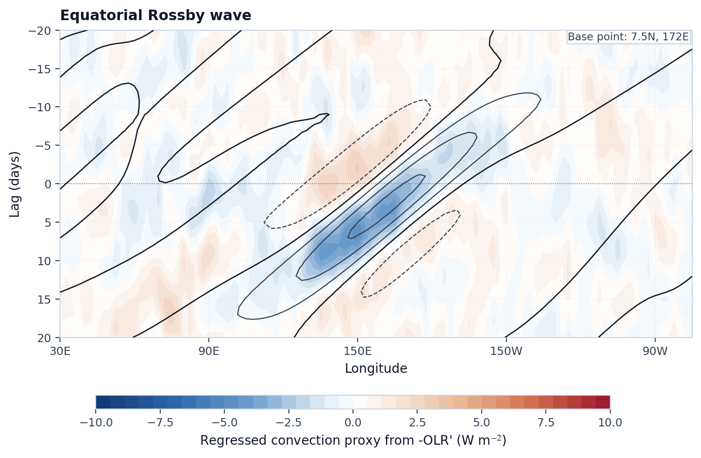
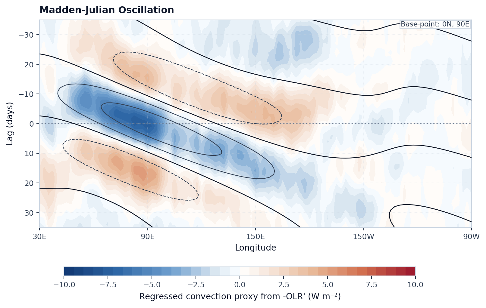
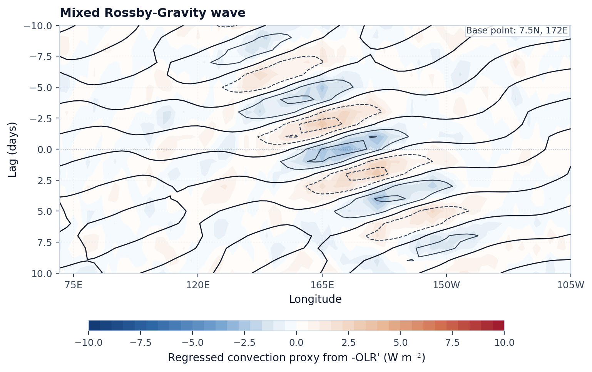
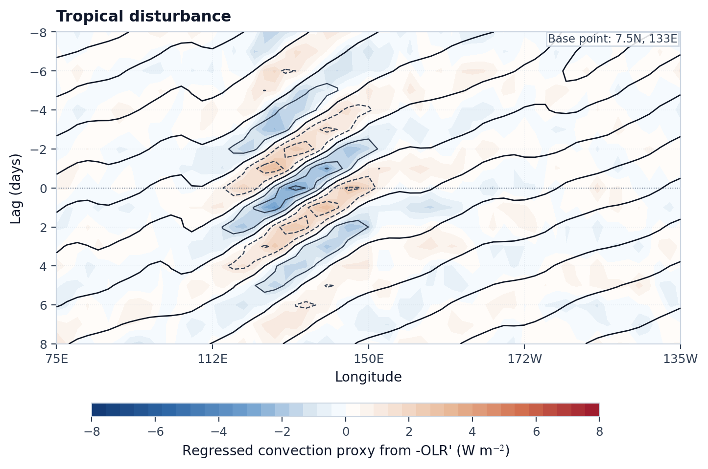

# Case 10: Paper-style Lagged Regression Hovmoller








### 波动传播方向和包络结构

填色采用 `-OLR'` 对流，实线和虚线显示滤波后的 `OLR'` 位相。

读图时的关键特征是：
- `Kelvin` 应明显东传；
- `ER` 应较慢西传；
- `MJO` 应表现为从印度洋向海陆大陆和西太平洋延伸的缓慢东传包络；
- `MRG` 需要区分“快速西传相位”和“慢速东传群传播”；
- `TD` 应在西北太平洋呈现西传并偏向西北的演变。


## Minimal Code

```python
from tropical_wave_tools.atlas import compute_case10_regression_hovmoller
from tropical_wave_tools.plotting import plot_paper_style_hovmoller

for wave in ["kelvin", "er", "mjo", "mrg", "td"]:
    result = compute_case10_regression_hovmoller(
        raw_olr_anomaly,
        filtered_olr[wave],
        wave_name=wave,
    )
    fig, ax = plot_paper_style_hovmoller(
        result["shading"],
        result["contours"],
        title=f"{wave.upper()} lagged-regression Hovmoller",
        base_point_label="literature base point",
    )
```

## Core Functions

- `compute_case10_regression_hovmoller`
- `plot_paper_style_hovmoller`
- `linear_regression`

## References

- Lubis, S. W., and C. Jacobi, 2015: The modulating influence of convectively coupled equatorial waves on the variability of tropical precipitation. *International Journal of Climatology*, 35, 1465–1483. https://doi.org/10.1002/joc.4069
- Kiladis, G. N., M. C. Wheeler, P. T. Haertel, K. H. Straub, and P. E. Roundy, 2009: Convectively coupled equatorial waves. *Reviews of Geophysics*, 47, RG2003. https://doi.org/10.1029/2008RG000266
