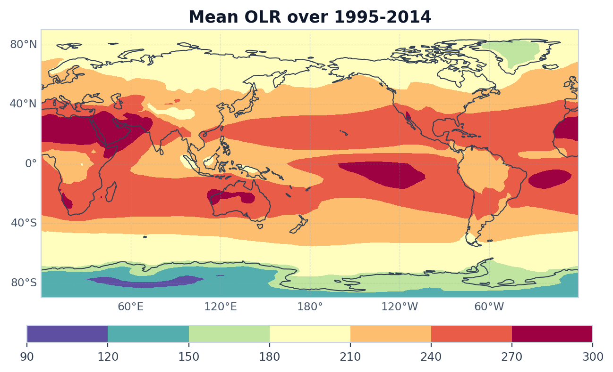
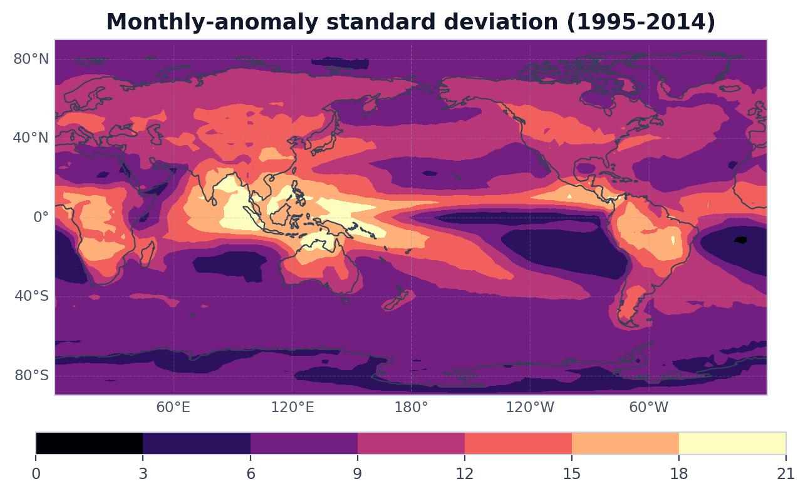

# Case 01: Sample OLR Preview and Variability





## Minimal Code

```python
from tropical_wave_tools.io import load_dataarray
from tropical_wave_tools.preprocess import compute_anomaly
from tropical_wave_tools.stats import standard_deviation
from tropical_wave_tools.plotting import plot_latlon_field

data = load_dataarray(
    "data/local/olr.day.mean.nc",
    variable="olr",
    time_range=("1979-01-01", "2014-12-31"),
    lat_range=(-90.0, 90.0),
)
plot_latlon_field(
    data.mean("time"),
    title="Mean OLR over 1979-2014",
    cmap="Spectral_r",
    integer_colorbar=True,
)
plot_latlon_field(
    standard_deviation(compute_anomaly(data, group="month"), dim="time"),
    title="Monthly-anomaly standard deviation (1979-2014)",
    cmap="magma",
    integer_colorbar=True,
    zero_floor_colorbar=True,
)
```

## Core Functions

- `load_dataarray`
- `compute_anomaly`
- `standard_deviation`
- `plot_latlon_field`

## Source Files

- [`src/tropical_wave_tools/io.py`](https://github.com/Blissful-Jasper/tropical-wave-tools/blob/main/src/tropical_wave_tools/io.py)
- [`src/tropical_wave_tools/preprocess.py`](https://github.com/Blissful-Jasper/tropical-wave-tools/blob/main/src/tropical_wave_tools/preprocess.py)
- [`src/tropical_wave_tools/stats.py`](https://github.com/Blissful-Jasper/tropical-wave-tools/blob/main/src/tropical_wave_tools/stats.py)
- [`src/tropical_wave_tools/plotting.py`](https://github.com/Blissful-Jasper/tropical-wave-tools/blob/main/src/tropical_wave_tools/plotting.py)
- [`scripts/generate_gallery.py`](https://github.com/Blissful-Jasper/tropical-wave-tools/blob/main/scripts/generate_gallery.py)
