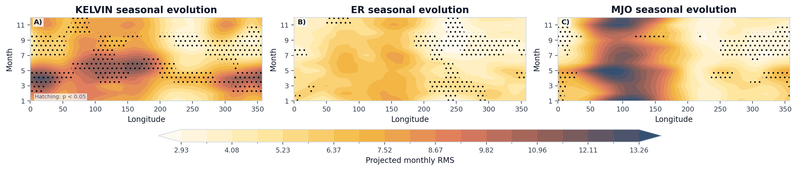
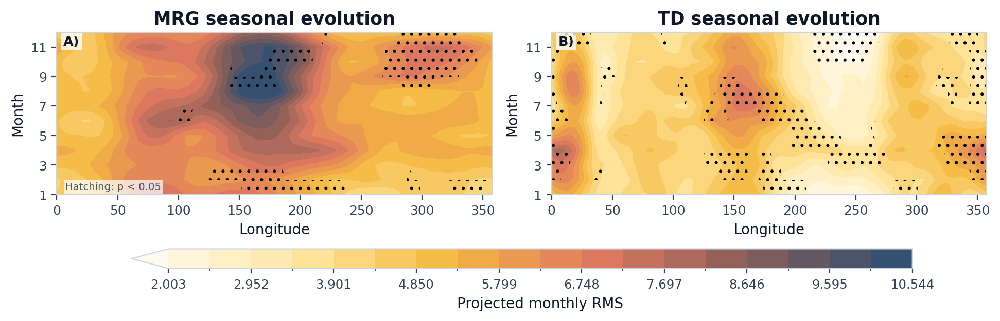

# Case 09: Seasonal Cycle, Annual Evolution and Trend





这两张图强调不同波型活动中心随月份和经度的迁移。读图时可以比较：`Kelvin` 和 `MJO` 的活动带是否沿赤道呈现更宽的季节性东移或西移；`MRG` 与 `TD` 是否在西太平洋和季风区显示更明显的夏秋峰值；`ER` 是否表现为偏低频、偏离赤道的西传背景。它们更适合回答“哪一类波在什么季节、什么经向带最活跃”这一类问题。

## Minimal Code

```python
from tropical_wave_tools.atlas import generate_local_wave_atlas

summary = generate_local_wave_atlas(
    output_dir="outputs/local_wave_atlas",
    waves=("kelvin", "er", "mjo", "mrg", "td"),
    time_range=("1979-01-01", "2014-12-31"),
    n_workers=1,
)
```

## Core Functions

- `compute_monthly_rms`
- `compute_monthly_climatology_and_significance`
- `compute_yearly_rms`
- `plot_wave_monthly_cycle_comparison`
- `plot_wave_monthly_longitude_comparison`
- `plot_wave_annual_trend_comparison`

## References

- Lubis, S. W., and C. Jacobi, 2015: The modulating influence of convectively coupled equatorial waves on the variability of tropical precipitation. *International Journal of Climatology*, 35, 1465-1483. https://doi.org/10.1002/joc.4069
- Kiladis, G. N., M. C. Wheeler, P. T. Haertel, K. H. Straub, and P. E. Roundy, 2009: Convectively coupled equatorial waves. *Reviews of Geophysics*, 47, RG2003. https://doi.org/10.1029/2008RG000266

## Source Files

- [`src/tropical_wave_tools/atlas.py`](https://github.com/Blissful-Jasper/tropical-wave-tools/blob/main/src/tropical_wave_tools/atlas.py)
- [`src/tropical_wave_tools/plotting.py`](https://github.com/Blissful-Jasper/tropical-wave-tools/blob/main/src/tropical_wave_tools/plotting.py)
