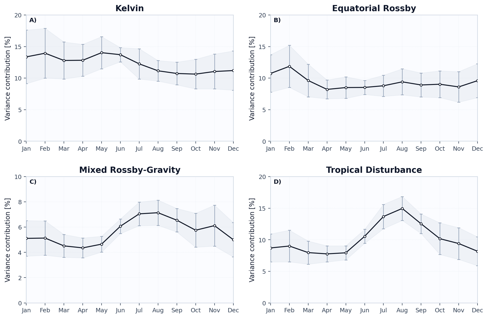
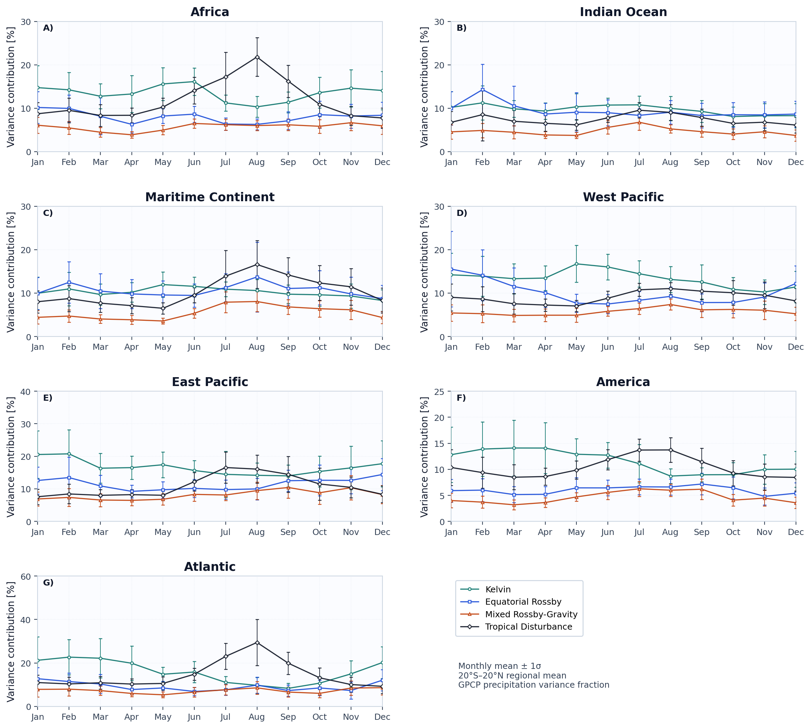

# Case 05: Seasonal Variance-Fraction Diagnostics





这两张图对应 Lubis and Jacobi (2015) 的季节方差占比视角，使用 `GPCP` 日降水来衡量不同波段对降水变率的贡献。纵轴是 `variance contribution [%]`，因此读图时重点是比较不同波型的季节峰值和区域差异，而不是比较绝对降水强度。`Kelvin`、`ER`、`MRG` 和 `TD-type` 的季节峰值不一定出现在同一个月份；区域图还能帮助区分 Africa、Indian Ocean、Maritime Continent、West Pacific、East Pacific、America 和 Atlantic 哪些区域更容易受特定波段调制。

## Minimal Code

```python
from tropical_wave_tools.atlas import generate_local_wave_atlas

summary = generate_local_wave_atlas(
    output_dir="outputs/local_wave_atlas",
    waves=("kelvin", "er", "mrg", "td"),
    time_range=("1997-01-01", "2014-12-31"),
    n_workers=1,
)
```

## Core Functions

- `compute_monthly_variance_fraction_samples`
- `summarize_variance_fraction_cycle`
- `plot_case05_seasonal_variance_cycles`
- `plot_case05_regional_variance_cycles`

## References

- Lubis, S. W., and C. Jacobi, 2015: The modulating influence of convectively coupled equatorial waves on the variability of tropical precipitation. *International Journal of Climatology*, 35, 1465–1483. https://doi.org/10.1002/joc.4069

## Source Files

- [`src/tropical_wave_tools/atlas.py`](https://github.com/Blissful-Jasper/tropical-wave-tools/blob/main/src/tropical_wave_tools/atlas.py)
- [`src/tropical_wave_tools/plotting.py`](https://github.com/Blissful-Jasper/tropical-wave-tools/blob/main/src/tropical_wave_tools/plotting.py)
