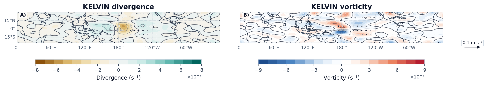
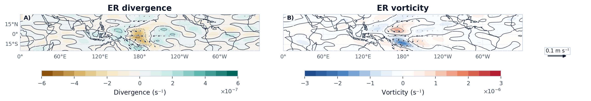
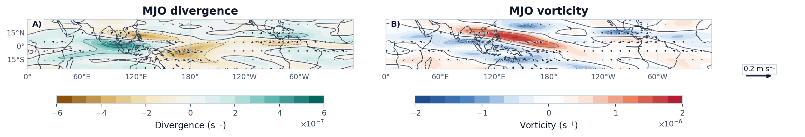
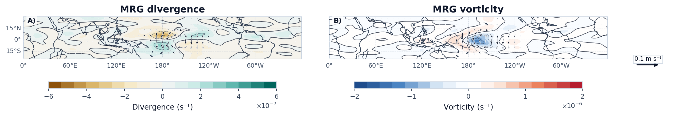
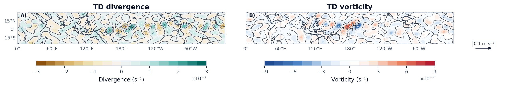

# Case 06: Low-level Wind Divergence and Vorticity







## Physical Meaning

- `Low-level divergence`: 用于检验对流活跃区附近是否伴随低层辐合，以及辐散偶极是否与波动传播方向相协调。对于 `Kelvin` 和 `MJO`，更值得关注的是赤道附近或大尺度包络中的辐合带配置（Kiladis et al., 2009; Wheeler and Hendon, 2004）。
- `Low-level vorticity`: 用于识别旋转型环流结构是否与理论模态一致。`ER`、`MRG` 和 `TD` 通常应表现出更清楚的气旋性/反气旋性 gyre 组织，而不仅仅是单纯的辐合辐散偶极（Matsuno, 1966; Yang et al., 2007; Lubis and Jacobi, 2015）。
- `Wind vectors`: 用于直接核对风向、辐合中心和涡度中心之间的相位关系。如果矢量、辐合辐散分布和正负涡度中心相互对应，则说明滤波后的低层动力结构具有物理一致性。

## Minimal Code

```python
from tropical_wave_tools.diagnostics import horizontal_divergence, relative_vorticity
from tropical_wave_tools.plotting import plot_wind_diagnostics_panel

for wave_name in ["kelvin", "er", "mjo", "mrg", "td"]:
    divergence = horizontal_divergence(filtered_u850[wave_name].sel(lag=0), filtered_v850[wave_name].sel(lag=0))
    vorticity = relative_vorticity(filtered_u850[wave_name].sel(lag=0), filtered_v850[wave_name].sel(lag=0))
    fig, axes = plot_wind_diagnostics_panel(
        divergence,
        vorticity,
        filtered_u850[wave_name].sel(lag=0),
        filtered_v850[wave_name].sel(lag=0),
        titles=(f"{wave_name.upper()} divergence", f"{wave_name.upper()} vorticity"),
    )
```

## Core Functions

- `horizontal_divergence`
- `relative_vorticity`
- `plot_wind_diagnostics_panel`

## References

- Matsuno, T., 1966: Quasi-geostrophic motions in the equatorial area. *Journal of the Meteorological Society of Japan*, 44, 25-43. https://doi.org/10.2151/jmsj1965.44.1_25
- Wheeler, M. C., and H. H. Hendon, 2004: An all-season real-time multivariate MJO index. *Monthly Weather Review*, 132, 1917-1932. https://doi.org/10.1175/1520-0493(2004)132<1917:AARMMI>2.0.CO;2
- Kiladis, G. N., M. C. Wheeler, P. T. Haertel, K. H. Straub, and P. E. Roundy, 2009: Convectively coupled equatorial waves. *Reviews of Geophysics*, 47, RG2003. https://doi.org/10.1029/2008RG000266
- Yang, G.-Y., B. J. Hoskins, and J. M. Slingo, 2007: Convectively coupled equatorial waves. Part II: Numerical simulations. *Journal of the Atmospheric Sciences*, 64, 3404-3423. https://doi.org/10.1175/JAS4018.1
- Lubis, S. W., and C. Jacobi, 2015: The modulating influence of convectively coupled equatorial waves on the variability of tropical precipitation. *International Journal of Climatology*, 35, 1465-1483. https://doi.org/10.1002/joc.4069

## Source Files

- [`src/tropical_wave_tools/diagnostics.py`](https://github.com/Blissful-Jasper/tropical-wave-tools/blob/main/src/tropical_wave_tools/diagnostics.py)
- [`src/tropical_wave_tools/plotting.py`](https://github.com/Blissful-Jasper/tropical-wave-tools/blob/main/src/tropical_wave_tools/plotting.py)
- [`src/tropical_wave_tools/atlas.py`](https://github.com/Blissful-Jasper/tropical-wave-tools/blob/main/src/tropical_wave_tools/atlas.py)
