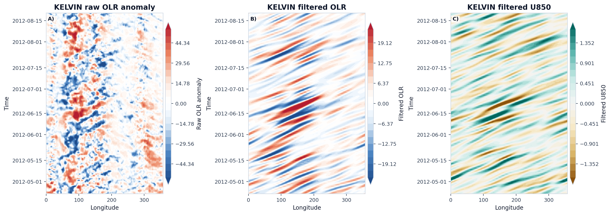
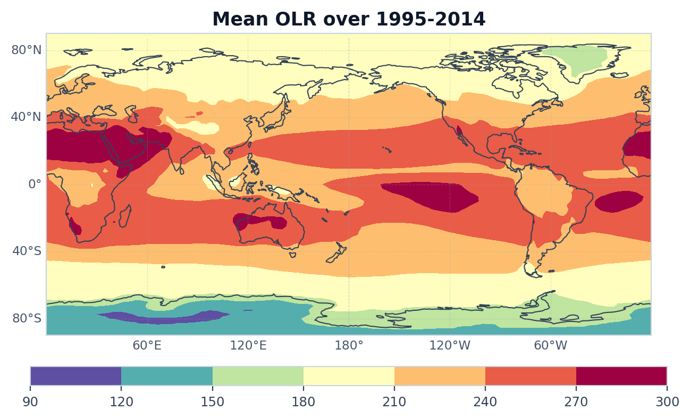
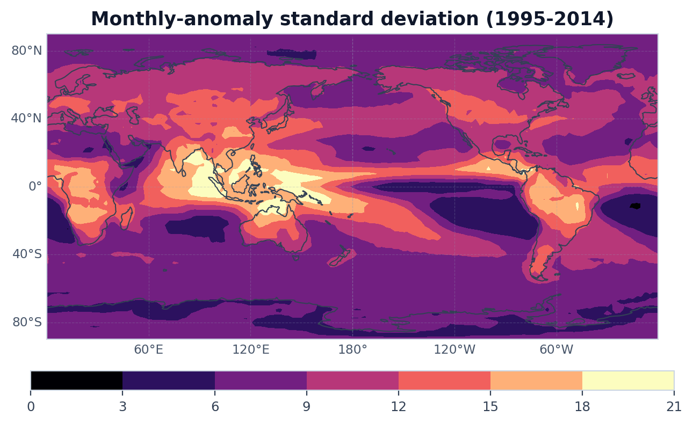
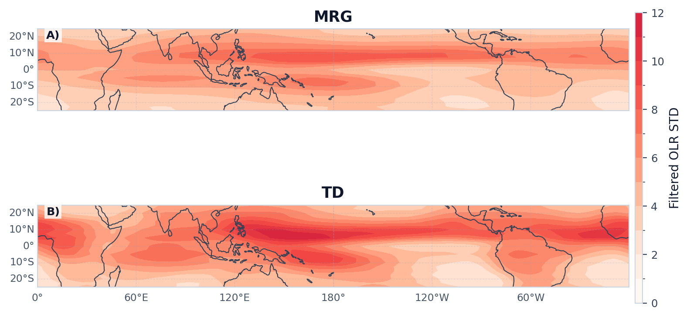

# Tropical Wave Tools

<section class="tw-hero">
  <div class="tw-hero-copy">
    <p class="tw-hero-kicker">Climate Diagnostics Toolkit</p>
    <p class="tw-hero-summary">
      面向热带波动与赤道波诊断的 Python 工具包，提供内置 OLR 样例、典型工作流和科研级结果图。
    </p>
    <div class="tw-hero-meta">
      <span class="tw-pill">xarray-first workflow</span>
      <span class="tw-pill">Built-in OLR showcase</span>
      <span class="tw-pill">WK spectrum + wave filters</span>
      <span class="tw-pill">Research-grade figures</span>
      <span class="tw-pill">Notes-ready structure</span>
    </div>
    <div class="tw-hero-actions">
      <a class="md-button md-button--primary" href="getting-started/">Quick Start</a>
      <a class="md-button" href="examples/">Gallery</a>
      <a class="md-button" href="api/">API</a>
      <a class="md-button" href="theory/">Methods</a>
    </div>
  </div>
  <div class="tw-hero-visual">
    
    
  </div>
</section>

## 核心栏目

<div class="tw-grid tw-grid-2">
  <article class="tw-card">
    <p class="tw-card-label">Quick Start</p>
    <h3>几分钟跑通第一个诊断</h3>
    <p>直接运行 WK 频谱和 Kelvin 滤波。</p>
  </article>
  <article class="tw-card">
    <p class="tw-card-label">Gallery</p>
    <h3>按结果图浏览典型工作流</h3>
    <p>从样例场到方法对比。</p>
  </article>
  <article class="tw-card">
    <p class="tw-card-label">API</p>
    <h3>按任务理解模块与函数</h3>
    <p>按任务分组浏览。</p>
  </article>
  <article class="tw-card">
    <p class="tw-card-label">Methods & Notes</p>
    <h3>长期扩展的方法说明与研究笔记</h3>
    <p>沉淀方法与研究记录。</p>
  </article>
</div>

## 从内置 OLR 到波动诊断

<div class="tw-workflow">
  <article class="tw-step">
    <p class="tw-step-label">Step 1</p>
    <h3>打开并标准化样例</h3>
    <p><code>open_example_olr</code> · <code>load_dataarray</code> · <code>standardize_data</code></p>
    <p>统一坐标与范围。</p>
  </article>
  <article class="tw-step">
    <p class="tw-step-label">Step 2</p>
    <h3>构建异常与基础统计</h3>
    <p><code>compute_anomaly</code> · <code>standard_deviation</code> · <code>linear_trend</code></p>
    <p>检查异常变率。</p>
  </article>
  <article class="tw-step">
    <p class="tw-step-label">Step 3</p>
    <h3>进入谱分析与波动诊断</h3>
    <p><code>analyze_wk_spectrum</code> · <code>plot_wk_spectrum</code></p>
    <p>查看频率-波数结构。</p>
  </article>
  <article class="tw-step">
    <p class="tw-step-label">Step 4</p>
    <h3>提取 Kelvin / ER / MJO 等信号</h3>
    <p><code>filter_wave_signal</code> · <code>WaveFilter</code> · <code>CCKWFilter</code></p>
    <p>提取目标波段信号。</p>
  </article>
</div>

## 最小调用示例

```python
from tropical_wave_tools import open_example_olr
from tropical_wave_tools.spectral import analyze_wk_spectrum
from tropical_wave_tools.plotting import plot_wk_spectrum

result = analyze_wk_spectrum(open_example_olr())
fig, axes = plot_wk_spectrum(result)
```

```python
from tropical_wave_tools import open_example_olr
from tropical_wave_tools.filters import filter_wave_signal

kelvin = filter_wave_signal(open_example_olr(), wave_name="kelvin", method="cckw", n_workers=1)
```

## Flagship Outputs

<div class="tw-grid tw-grid-2">
  <article class="tw-card tw-gallery-card">
    <p class="tw-card-label">Preview</p>
    <h3>内置样例场与异常变率</h3>
    <p>时间平均场与异常变率。</p>
    
    
  </article>
  <article class="tw-card tw-gallery-card">
    <p class="tw-card-label">Diagnostics</p>
    <h3>WK 频谱与代表波型的空间分布</h3>
    <p>频率-波数结构，以及大尺度波与西传 synoptic 波的 filter 后 STD 对比。</p>
    
    
    
  </article>
</div>

## 建议从哪里开始

<div class="tw-grid tw-grid-2">
  <article class="tw-card">
    <p class="tw-card-label">Quick Start</p>
    <h3><a href="getting-started/">最短上手路径</a></h3>
    <p>安装、样例、最短代码。</p>
  </article>
  <article class="tw-card">
    <p class="tw-card-label">Gallery</p>
    <h3><a href="examples/">按结果图浏览功能</a></h3>
    <p>结果图与对应函数。</p>
  </article>
  <article class="tw-card">
    <p class="tw-card-label">API</p>
    <h3><a href="api/">按模块浏览函数</a></h3>
    <p>模块与核心函数。</p>
  </article>
  <article class="tw-card">
    <p class="tw-card-label">Methods & Notes</p>
    <h3><a href="theory/">按原理与笔记继续扩展</a></h3>
    <p>方法流程与研究记录。</p>
  </article>
</div>
