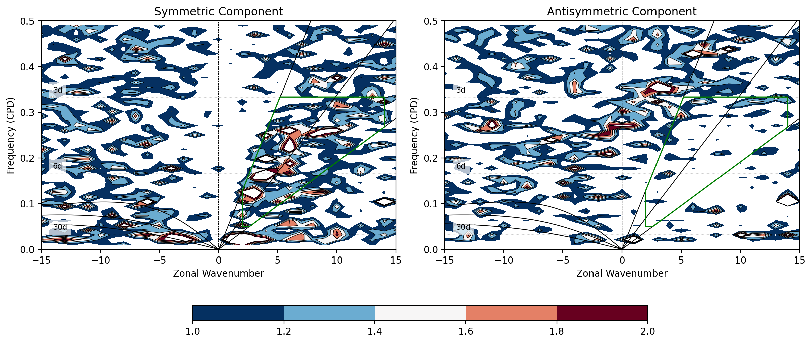
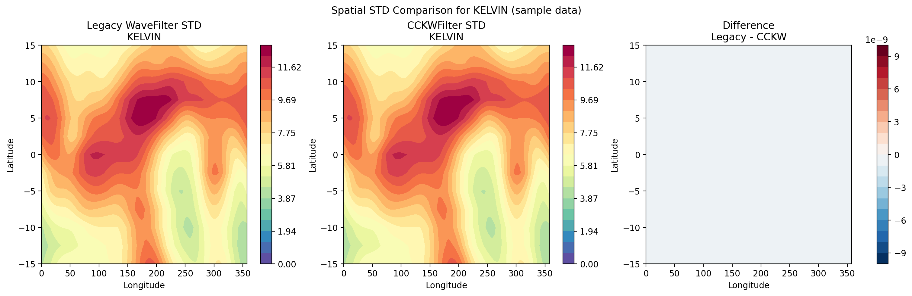

# Tropical Wave Tools

这个站点展示基于原始 `wave_tools` 重构后的新项目，包括：

- 更清晰的包结构
- 基于 `xarray` 的标准数据入口
- Wheeler-Kiladis 频谱分析
- Kelvin / ER / MJO 等波动滤波
- 交叉谱、EOF 与 Kelvin phase composite
- GitHub 友好的示例、测试和文档布局

## 这个项目解决了什么问题

原始代码已经有很高的科研价值，但长期维护时常见的问题包括：

- 计算与绘图混在一起
- 模块导出过多且不稳定
- 大文件示例不适合直接托管到 GitHub
- 缺少统一 CLI、文档和测试

重构后的方案把这些内容拆分成：

- `io.py`: 数据读取与标准化
- `preprocess.py`: 区域选择、时间选择、气候态、异常、季节平均
- `preprocessing.py`: 低层频谱预处理与兼容函数
- `diagnostics.py`: 区域平均、dx/dy、GMS 相关诊断
- `spectral.py`: WK 频谱分析
- `cross_spectrum.py`: 交叉谱与相干分析
- `cross_spectrum_analysis.py`: 多试验交叉谱工作流
- `stats.py`: 趋势、相关、回归、方差、标准差
- `eof.py`: EOF 与垂直模态分析
- `phase.py`: Kelvin 位相识别与 composite 分析
- `filters.py`: 传统滤波与 CCKWFilter
- `plotting.py`: 结果绘图
- `workflows.py`: 面向用户的完整工作流
- `cli.py`: 命令行入口

## 结果展示

### WK 频谱图

### Kelvin 滤波空间标准差对比

